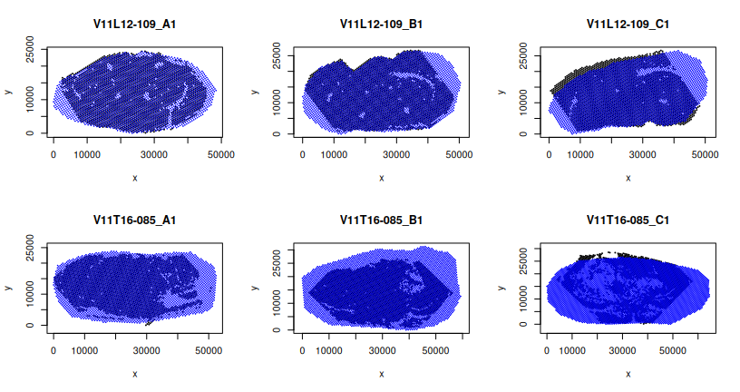
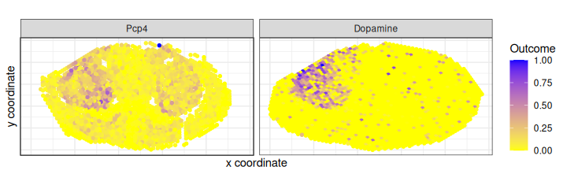
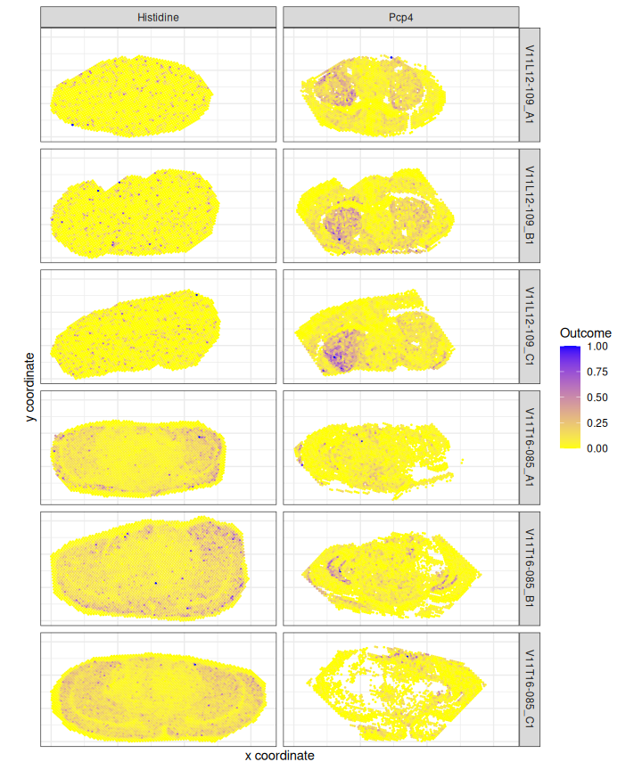

SBIVAR: Spatial BIVARiate association tests across disjoint coordinate
sets
================

This repo provides code for performing bivariate association tests
between different spatial modalities measured on the same or consecutive
slices, possibly with disjoint coordinate sets. A common coordinate
framework as obtained from alignment is considered given.

<!-- % As introduced in our [preprint](). -->

The package can be installed from GitHub as follows:

``` r
remotes::install_github("sthawinke/sbivar", build_vignettes = TRUE)
```

Once installed, you can load the package

``` r
library(sbivar)
```

As example dataset, we use the one by [Vicari et
al. (2024)](https://doi.org/10.1038/s41587-023-01937-y), which includes
replicated measurements of spatial transcriptomics and metabolomics
coprofiled on mouse brain sections. A subset of the data is available in
the *sbivar* package and can be loaded as:

``` r
data(Vicari)
```

This object consists of four lists of length six: *MetaboliteCoords* and
*TranscriptCoords* for the coordinates, and *TranscriptOutcomes* and
*MetaboliteOutcomes* for the feature measurements. Have a look at the
aligned coordinates:

``` r
par(mfrow = c(2, 3))
plotCoordsMulti(Vicari$TranscriptCoords, Vicari$MetaboliteCoords, cex = 0.1)
```

<!-- -->

``` r
par(mfrow = c(1, 1))
```

## Single-image analysis

The Vicari data consist of six images which could be analysed jointly,
but for didactical purposes we also analyse a single image here, the
sample “V11L12-109_A1”.

``` r
singleSample <- "V11L12-109_A1"
singleStxCoords <- Vicari$TranscriptCoords[[singleSample]]
singleStx <- Vicari$TranscriptOutcomes[[singleSample]]
singleMetCoords <- Vicari$MetaboliteCoords[[singleSample]]
singleMet <- Vicari$MetaboliteOutcomes[[singleSample]]
```

Now analyse this single sample using bivariate Moran’s I.

``` r
library(BiocParallel)
register(MulticoreParam(2))
```

``` r
moranRes <- sbivar(singleStx, singleMet, singleStxCoords, singleMetCoords,
    method = "Moran's I"
)
```

    ## Starting sbivar analysis of a single image on 2 computing cores

    ## Testing significance of bivariate Moran's I for 25 feature pairs

    ## Calculating bivariate Moran's I statistics ...

    ## Fitting variograms for first modality (5 features) ...

    ## Fitting variograms for second modality (5 features) ...

    ## Calculating variances of bivariate Moran's I statistics ...

Have a look at the results:

``` r
head(moranRes$result)
```

    ##   Modality_X Modality_Y     Ixy_5e.06     Ixy_2e.04      Ixy_0.02 SE.Ixy._5e.06
    ## 1     mt.Co1 X555.20345 -9.984208e-05 -6.517426e-05 -1.209285e-05  5.899893e-05
    ## 2     mt.Co1 X555.20713 -1.000362e-04 -6.434524e-05 -1.153149e-05  5.937060e-05
    ## 3     mt.Co3 X573.23369 -2.717639e-05 -2.516587e-05 -1.028394e-05  3.074321e-05
    ## 4     mt.Co1 X573.23369 -2.185709e-05 -2.581689e-05 -7.749194e-06  2.965036e-05
    ## 5     mt.Co2 X573.23369 -2.291890e-05 -2.431242e-05 -1.010922e-05  3.094869e-05
    ## 6    mt.Atp6 X573.23369 -1.998723e-05 -2.527243e-05 -9.727530e-06  3.043709e-05
    ##   SE.Ixy._2e.04 SE.Ixy._0.02      pVal     pAdj
    ## 1  5.612845e-05 5.320337e-05 0.2571320 0.993726
    ## 2  5.652231e-05 5.363631e-05 0.2700359 0.993726
    ## 3  2.462482e-05 2.209417e-05 0.4345555 0.993726
    ## 4  2.318742e-05 2.065942e-05 0.4718203 0.993726
    ## 5  2.484135e-05 2.243004e-05 0.4774986 0.993726
    ## 6  2.423177e-05 2.168803e-05 0.4808390 0.993726

Plot the most significantly spatially associated gene-metabolite pair :

``` r
plotTopPair(moranRes, singleStx, singleMet, singleStxCoords, singleMetCoords)
```

<!-- -->

Write the results to a spreadsheet

``` r
writeSbivarToXlsx(moranRes, file = "myfile.xlsx")
```

## Multi-image analysis

Next, we analyse the six images jointly. First construct a variable
identifying the mouse, consisting of the first 10 characters of the
names:

``` r
mouse <- substr(names(Vicari$TranscriptOutcomes), 1, 10)
```

For the multi-image case, we use GAMs as measure of spatial association,
with a negative binomial outcome distribution for the transcriptome
data, and a gamma outcome distribution for the metabolome data. A
log-link is used in both cases.

``` r
multiGAMRes <- sbivar(
    X = Vicari$TranscriptOutcomes, Y = Vicari$MetaboliteOutcomes,
    Cx = Vicari$TranscriptCoords, Ey = Vicari$MetaboliteCoords,
    method = "GAM", families = list("X" = mgcv::nb(), "Y" = Gamma(lin = "log"))
)
```

    ## Starting sbivar analysis (GAMs) of 6 images on 2 computing cores

    ## Image 1 of 6

    ## Image 2 of 6

    ## Image 3 of 6

    ## Image 4 of 6

    ## Image 5 of 6

    ## Image 6 of 6

Next we plug the calculated correlations between the spline surfaces
into a linear model, with random effects for the individual mice:

``` r
design <- data.frame("mouse" = mouse)
multiGAMLmms <- fitLinModels(multiGAMRes, design, Formula = ~ (1 | mouse))
```

    ## Fitting 25 mixed effects models on 2 cores

Extract the results for the desired parameter (the intercept)

``` r
multiGAMLmmsRes <- extractResultsMulti(multiGAMLmms, design)
head(multiGAMLmmsRes$result$Intercept)
```

    ##   Modality_X Modality_Y    Estimate         SE      pVal      pAdj
    ## 1     mt.Co3 X523.19829 -0.10048418 0.05975443 0.1534708 0.9158535
    ## 2     mt.Co1 X523.19829  0.11585824 0.06982157 0.1579411 0.9158535
    ## 3     mt.Co1 X555.20713  0.03733817 0.03145645 0.2885510 0.9158535
    ## 4    mt.Cytb X555.20713 -0.02968372 0.02758507 0.3310510 0.9158535
    ## 5    mt.Atp6 X555.20713  0.05759791 0.03349672 0.3353404 0.9158535
    ## 6     mt.Co2 X573.23369  0.08397566 0.05757616 0.3826185 0.9158535

No features are significantly associated after multiplicity correction.
For illustration, we plot the feature pair with the smallest p-values
nevertheless:

``` r
plotTopPair(multiGAMLmmsRes,
    Xl = Vicari$TranscriptOutcomes, Yl = Vicari$MetaboliteOutcomes,
    Cxl = Vicari$TranscriptCoords, Eyl = Vicari$MetaboliteCoords, size = 0.3
)
```

<!-- -->

A more extensive description of the sbivar functionality can be found in
the vignette, accessed by calling

``` r
browseVignettes("sbivar")
```
