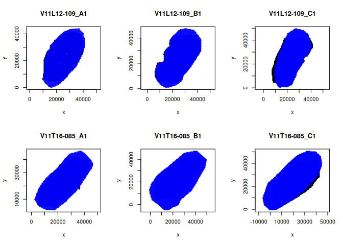
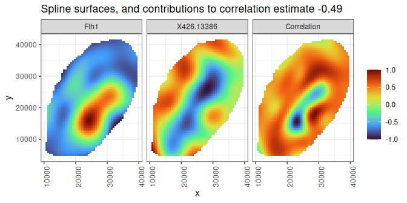

SBIVAR:
Spatial BIVARiate association tests across disjoint coordinate sets
================

This repo provides code for performing bivariate association tests
between different spatial modalities measured on the same or consecutive
slices, possibly with disjoint coordinate sets. A common coordinate
framework (CCF) as obtained from alignment is considered given.

<!-- % As introduced in our [preprint](). -->

The package can be installed from GitHub as follows:

``` r
library(devtools)
install_github("sthawinke/sbivar")
```

Once installed, you can load the package

``` r
library(sbivar)
```

As example dataset, we load the one by [Vicari et
al. (2024)](https://doi.org/10.1038/s41587-023-01937-y), which includes
replicated measurements of spatial transcriptomics and metabolomics
coprofiled on mouse brain sections. A subset of the data is available in
the *sbivar* package and can be loaded as:

``` r
data(Vicari)
```

This object consists of four lists of length six: *MetaboliteCoords* and
*TranscriptCoords* for the coordinates, and *TranscriptOutcomes* and
*MetaboliteOutcomes* for the feature measurements. Checking the
alignment of the coordinates:

``` r
par(mfrow = c(2,3))
plotCoordsMulti(Vicari$TranscriptCoords, Vicari$MetaboliteCoords, cex = 0.5)
```

<!-- -->

``` r
par(mfrow = c(1,1))
```

## Single-image analysis

The Vicari data consist of six image which are best analysed jointly,
but for didactical purposes we also analyse a single image here, the
sample “V11L12-109_A1”.

``` r
singleSample = "V11L12-109_A1"
singleStxCoords = Vicari$TranscriptCoords[[singleSample]]
singleStx = Vicari$TranscriptOutcomes[[singleSample]]
singleMetCoords = Vicari$MetaboliteCoords[[singleSample]]
singleMet = Vicari$MetaboliteOutcomes[[singleSample]]
```

Now analyse this single sample using generalized additive models (GAMs),
with a negative binomial outcome distribution for the transcriptome
data, and a gamma outcome distribution for the metabolome data. A
log-link is used in both cases.

``` r
gamRes = sbivarSingle(singleStx, singleMet, singleStxCoords, singleMetCoords, 
                      method = "GAMs", families = list("X" = mgcv::nb(), "Y" = Gamma(lin = "log")))
```

Have a look at the results:

``` r
head(gamRes)
```

    ##                         corxy   se.corxy         pVal         pAdj
    ## Fth1__X426.13386   -0.6235648 0.03376571 3.778484e-76 3.022787e-74
    ## Fth1__X537.21448   -0.7678727 0.04349708 9.575449e-70 3.830180e-68
    ## Fth1__X576.20502    0.5364918 0.03614188 7.602646e-50 2.027372e-48
    ## mt.Co3__X573.21671 -0.7490288 0.05298734 2.278872e-45 4.557743e-44
    ## Fth1__X573.21671    0.6821924 0.04960751 4.968026e-43 7.948841e-42
    ## mt.Co3__X537.21448  0.6924677 0.05107560 7.133813e-42 9.511750e-41

Plot the most significantly spatially associated gene-metabolite pair :

``` r
plotTopResultsSingle(gamRes, singleStx, singleMet, singleStxCoords, singleMetCoords)
```

<!-- -->

We can also plot the corresponding spline fit, with the contributions to
the correlation -0.624:

``` r
plotGAMsTopResults(gamRes, singleStx, singleMet, singleStxCoords, singleMetCoords)
```

<!-- -->

## Multi-image analysis

Next, we analyse the six images jointly. First construct a variable
identifying the mouse, consisting of the first 10 characters of the
names:

``` r
mouse = vapply(names(Vicari$TranscriptOutcomes), FUN.VALUE = character(1), function(x) substr(x,1, 10))
```

For the multi-image case, we use bivariate Moran’s I as measure of
spatial association, with weights of the weight matrix decaying with
distance:

``` r
multiMoranRes = sbivarMulti(Xl = Vicari$TranscriptOutcomes, Yl = Vicari$MetaboliteOutcomes, 
                            Cxl = Vicari$TranscriptCoords, Eyl = Vicari$MetaboliteCoords, 
                            method = "Moran", wo = "distance")
```

Next we plug the calculated Moran’s I values into a linear model, with
random effects for the individual mice:

``` r
design = data.frame("mouse" = mouse)
multiMoranLmms = fitLinModels(multiMoranRes, design, Formula = ~ (1|mouse))
```

Extract the results for the desired parameter (the intercept)

``` r
multiMoranLmmsRes  = extractResultsMulti(multiMoranLmms, design)
head(multiMoranLmmsRes$Intercept)
```

    ##                        Estimate          SE       pVal      pAdj
    ## mt.Cytb__X555.20713 -0.03518101 0.010491203 0.02025382 0.4827185
    ## Fth1__X573.21671     0.03450211 0.010305698 0.02037630 0.4827185
    ## mt.Nd1__X555.20713  -0.03149509 0.009942476 0.02487818 0.4827185
    ## mt.Co1__X555.20713  -0.02999445 0.009827300 0.02835449 0.4827185
    ## mt.Nd2__X555.20713  -0.03040737 0.010019648 0.02892305 0.4827185
    ## mt.Atp6__X555.20713 -0.03035158 0.010184514 0.03079390 0.4827185

No features are significantly associated after multiplicity correction.
For illustration, we plot the feature pair with the smallest p-values
nevertheless:

``` r
plotTopResultsMulti(multiMoranLmmsRes, 
    Xl = Vicari$TranscriptOutcomes, Yl = Vicari$MetaboliteOutcomes, 
    Cxl = Vicari$TranscriptCoords, Eyl = Vicari$MetaboliteCoords, size = 0.4)
```

<!-- -->

<!-- A more extensive description of the sbivar functionality can be found in the vignette, which can be accessed by calling -->

<!-- ```{r openVignette, eval = FALSE} -->

<!-- browseVignettes("sbivar") -->

<!-- ``` -->
